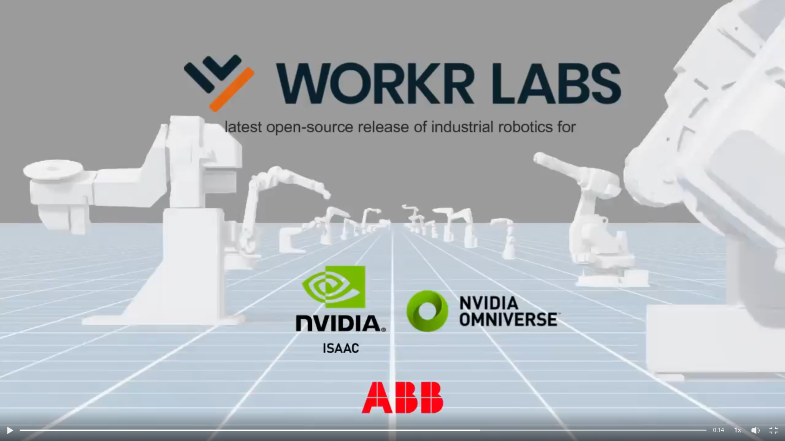
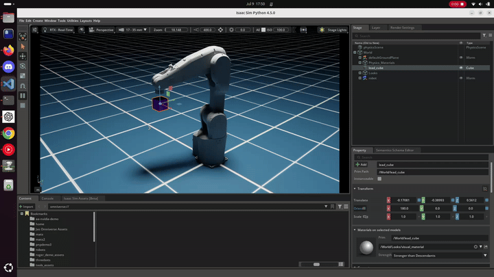

# ABB Robot Models Repository

This repository contains ABB industrial robot models in URDF format for ROS and Isaac Sim integration.

[Release Announcement](https://www.linkedin.com/feed/update/urn:li:activity:7348423533506547712/)

## Features

### Interactive Inverse Kinematics

## Robot Models Status

| Robot Name | Type | Input URDF | Processed URDF | USD File | Status |
|------------|------|------------|----------------|----------|--------|
| **CRB15000_10kg-152** | Cobot | [XACRO](ABB/CRB15000_10kg-152/CRB15000_10kg-152_description/urdf/CRB15000_10kg-152.xacro) | [Processed](generated/CRB15000_10kg_152_v1/CRB15000_10kg_152.urdf) | [USD](generated/CRB15000_10kg_152_v1/CRB15000_10kg_152/CRB15000_10kg_152.usd) | ✅ Complete |
| **CRB15000_12kg-127** | Cobot | [XACRO](ABB/CRB15000_12kg-127/CRB15000_12-127_description/urdf/CRB15000_12-127.xacro) | [Processed](generated/CRB15000_12kg_127_v1/CRB15000_12kg_127.urdf) | [USD](generated/CRB15000_12kg_127_v1/CRB15000_12kg_127/CRB15000_12kg_127.usd) | ✅ Complete |
| **CRB15000_5kg-950** | Cobot | [XACRO](ABB/CRB15000_5kg-950/CRB15000_5kg-950_description/urdf/CRB15000_5kg-950.xacro) | [Processed](generated/CRB15000_5kg_950_v1/CRB15000_5kg_950.urdf) | [USD](generated/CRB15000_5kg_950_v1/CRB15000_5kg_950/CRB15000_5kg_950.usd) | ✅ Complete |
| **IRB1010_1.5kg-370** | Industrial Robot | [XACRO](ABB/IRB1010_1.5kg-370/IRB1010_1.5kg-370_description/urdf/IRB1010_1.5kg-370.xacro) | [Processed](generated/IRB1010_1_5kg_370_v1/IRB1010_1_5kg_370.urdf) | [USD](generated/IRB1010_1_5kg_370_v1/IRB1010_1_5kg_370/IRB1010_1_5kg_370.usd) | ✅ Complete |
| **IRB1100_4kg-475-STD** | Industrial Robot | [XACRO](ABB/IRB1100_4kg-475-STD/IRB1100_4kg-475-STD_description/urdf/IRB1100_4kg-475-STD.xacro) | [Processed](generated/IRB1100_4kg_475_STD_v1/IRB1100_4kg_475_STD.urdf) | [USD](generated/IRB1100_4kg_475_STD_v1/IRB1100_4kg_475_STD/IRB1100_4kg_475_STD.usd) | ✅ Complete |
| **IRB1100_4kg-580-STD** | Industrial Robot | [XACRO](ABB/IRB1100_4kg-580-STD/IRB1100_4kg-580-STD_description/urdf/IRB1100_4kg-580-STD.xacro) | [Processed](generated/IRB1100_4kg_580_STD_v1/IRB1100_4kg_580_STD.urdf) | [USD](generated/IRB1100_4kg_580_STD_v1/IRB1100_4kg_580_STD/IRB1100_4kg_580_STD.usd) | ✅ Complete |
| **IRB1200_5kg-90** | Industrial Robot | [XACRO](ABB/IRB1200_5kg-90/IRB1200_5-90-STD_description/urdf/IRB1200_5-90-STD.xacro) | [Processed](generated/IRB1200_5_90_STD_v1/IRB1200_5_90_STD.urdf) | [USD](generated/IRB1200_5_90_STD_v1/IRB1200_5_90_STD/IRB1200_5_90_STD.usd) | ✅ Complete |
| **IRB1200H_5-90-STD** | Industrial Robot | [XACRO](ABB/IRB1200H_5-90-STD/IRB1200H_5-90-STD_description/urdf/IRB1200H_5-90-STD.xacro) | [Processed](generated/IRB1200H_5_90_STD_v1/IRB1200H_5_90_STD.urdf) | [USD](generated/IRB1200H_5_90_STD_v1/IRB1200H_5_90_STD/IRB1200H_5_90_STD.usd) | ✅ Complete |
| **IRB1200H_7-70-STD** | Industrial Robot | [XACRO](ABB/IRB1200H_7-70-STD/IRB1200H_7-70-STD_description/urdf/IRB1200H_7-70-STD.xacro) | [Processed](generated/IRB1200H_7_70_STD_v1/IRB1200H_7_70_STD.urdf) | [USD](generated/IRB1200H_7_70_STD_v1/IRB1200H_7_70_STD/IRB1200H_7_70_STD.usd) | ✅ Complete |
| **IRB14000_Yumi** | Dual-Arm Cobot | [XACRO](ABB/IRB14000_Yumi/IRB14000_rev01_description/urdf/IRB14000_rev01.xacro) | [Processed](generated/IRB14000_Yumi_v1/IRB14000_Yumi.urdf) | [USD](generated/IRB14000_Yumi_v1/IRB14000_Yumi/IRB14000_Yumi.usd) | ✅ Complete |
| **IRB14050_SAYuMi** | Dual-Arm Cobot | [XACRO](ABB/IRB14050_SAYuMi/IRB14050_SAYuMi_-_rev00_description/urdf/IRB14050_SAYuMi_-_rev00.xacro) | [Processed](generated/IRB14050_SAYuMi_v1/IRB14050_SAYuMi.urdf) | [USD](generated/IRB14050_SAYuMi_v1/IRB14050_SAYuMi/IRB14050_SAYuMi.usd) | ✅ Complete |
| **IRB1520ID_4-150** | Industrial Robot | [XACRO](ABB/IRB1520ID_4-150/IRB1520ID_4_150_description/urdf/IRB1520ID_4_150.xacro) | [Processed](generated/IRB1520ID_4_150_v1/IRB1520ID_4_150.urdf) | [USD](generated/IRB1520ID_4_150_v1/IRB1520ID_4_150/IRB1520ID_4_150.usd) | ✅ Complete |
| **IRB1600_X-120** | Industrial Robot | [XACRO](ABB/IRB1600_X-120/IRB1600_X-120_description/urdf/IRB1600_X-120.xacro) | [Processed](generated/IRB1600_X-120_v1/IRB1600_X-120.urdf) | [USD](generated/IRB1600_X-120_v1/IRB1600_X-120/IRB1600_X-120.usd) | ✅ Complete |
| **IRB460_110-240** | Palletizing Robot | [XACRO](ABB/IRB460_110-240/IRB_description/urdf/IRB.xacro) | [Processed](generated/IRB460_110-240_v1/IRB460_110-240.urdf) | [USD](generated/IRB460_110-240_v1/IRB460_110-240/IRB460_110-240.usd) | ✅ Complete |
| **IRB52_7-1.2-Short** | Paint Robot | [XACRO](ABB/IRB52_7-1.2-Short/IRB52_7-1.2-Short_description/urdf/IRB52_7-1.2-Short.xacro) | [Processed](generated/IRB52_7-1_2-Short_v1/IRB52_7-1_2-Short.urdf) | [USD](generated/IRB52_7-1_2-Short_v1/IRB52_7-1_2-Short/IRB52_7-1_2-Short.usd) | ✅ Complete |
| **IRB52_7-1.45-Long** | Paint Robot | [XACRO](ABB/IRB52_7-1.45-Long/IRB52_long_T00F81B51V41H61_rev1_description/urdf/IRB52_long_T00F81B51V41H61_rev1.xacro) | [Processed](generated/IRB52_7-1_45-Long_v1/IRB52_7-1_45-Long.urdf) | [USD](generated/IRB52_7-1_45-Long_v1/IRB52_7-1_45-Long/IRB52_7-1_45-Long.usd) | ✅ Complete |
| **IRB5500-22** | Industrial Robot | [XACRO](ABB/IRB5500-22/IRB5500-22_rev00_description/urdf/IRB5500-22_rev00.xacro) | [Processed](generated/IRB5500-22_v1/IRB5500-22.urdf) | [USD](generated/IRB5500-22_v1/IRB5500-22/IRB5500-22.usd) | ✅ Complete |
| **IRB5500-27** | Industrial Robot | [XACRO](ABB/IRB5500-27/IRB5500-27_rev00_description/urdf/IRB5500-27_rev00.xacro) | [Processed](generated/IRB5500-27_v1/IRB5500-27.urdf) | [USD](generated/IRB5500-27_v1/IRB5500-27/IRB5500-27.usd) | ✅ Complete |
| **IRB5510-12** | Industrial Robot | [XACRO](ABB/IRB5510-12/IRB5510-12_rev00_CAD_description/urdf/IRB5510-12_rev00_CAD.xacro) | [Processed](generated/IRB5510-12_v1/IRB5510-12.urdf) | [USD](generated/IRB5510-12_v1/IRB5510-12/IRB5510-12.usd) | ✅ Complete |
| **IRB6750S_185-390** | Industrial Robot | [XACRO](ABB/IRB6750S_185-390/IRB6750S_185-390-LID_description/urdf/IRB6750S_185-390-LID.xacro) | [Processed](generated/IRB6750S_185-390-LID_v1/IRB6750S_185-390-LID.urdf) | [USD](generated/IRB6750S_185-390-LID_v1/IRB6750S_185-390-LID/IRB6750S_185-390-LID.usd) | ✅ Complete |
| **IRB8700_550-420-SW6** | Industrial Robot | [XACRO](ABB/IRB8700_550-420-SW6/IRB8700_550-420-SW6_description/urdf/IRB8700_550-420-SW6.xacro) | [Processed](generated/IRB8700_550-420-SW6_v1/IRB8700_550-420-SW6.urdf) | [USD](generated/IRB8700_550-420-SW6_v1/IRB8700_550-420-SW6/IRB8700_550-420-SW6.usd) | ✅ Complete |
| **IRB8700_800-350** | Industrial Robot | [XACRO](ABB/IRB8700_800-350/IRB8700_800-350_description/urdf/IRB8700_800-350.xacro) | [Processed](generated/IRB8700_800_350_v1/IRB8700_800_350.urdf) | [USD](generated/IRB8700_800_350_v1/IRB8700_800_350/IRB8700_800_350.usd) | ✅ Complete |
| **IRB910INV-350** | SCARA Robot | [XACRO](ABB/IRB910INV-350/IRB_description/urdf/IRB.xacro) | [Processed](generated/IRB910INV-350_v1/IRB910INV-350.urdf) | [USD](generated/IRB910INV-350_v1/IRB910INV-350/IRB910INV-350.usd) | ✅ Complete |
| **IRB910INV-550** | SCARA Robot | [XACRO](ABB/IRB910INV-550/IRB_description/urdf/IRB.xacro) | [Processed](generated/IRB910INV-550_v1/IRB910INV-550.urdf) | [USD](generated/IRB910INV-550_v1/IRB910INV-550/IRB910INV-550.usd) | ✅ Complete |
| **IRB920_6kg-550-180-STD** | Industrial Robot | [XACRO](ABB/IRB920_6kg-550-180-STD/ABB_IRB920_6kg-550-180-STD_description/urdf/ABB_IRB920_6kg-550-180-STD.xacro) | [Processed](generated/IRB920_6kg-550-180-STD_v1/IRB920_6kg_550_180_STD.urdf) | [USD](generated/IRB920_6kg_550_180_STD_v1/IRB920_6kg_550_180_STD/IRB920_6kg_550_180_STD.usd) | ✅ Complete |
| **IRB920_6kg-650-180-STD** | Industrial Robot | [XACRO](ABB/IRB920_6kg-650-180-STD/IRB920_6kg-650-180-STD_OmniCore_rev00_Assembly_description/urdf/IRB920_6kg-650-180-STD_OmniCore_rev00_Assembly.xacro) | [Processed](generated/IRB920_6kg_650_180_STD_v1/IRB920_6kg_650_180_STD.urdf) | [USD](generated/IRB920_6kg_650_180_STD_v1/IRB920_6kg_650_180_STD/IRB920_6kg_650_180_STD.usd) | ✅ Complete |
| **IRB920_6kg_55-180-STD** | Industrial Robot | [URDF](ABB/IRB920_6kg_55-180-STD/abb_irb920.urdf) | [Processed](generated/abb_irb920_v1/abb_irb920.urdf) | [USD](generated/abb_irb920_v1/abb_irb920/abb_irb920.usd) | ✅ Complete |
| **IRB920T_6kg-450-180-STD** | Industrial Robot | [XACRO](ABB/IRB920T_6kg-450-180-STD/(Unsaved)_description/urdf/(Unsaved).xacro) | [Processed](generated/IRB920T_6kg_450_180_STD_v1/IRB920T_6kg_450_180_STD.urdf) | [USD](generated/IRB920T_6kg_450_180_STD_v1/IRB920T_6kg_450_180_STD/IRB920T_6kg_450_180_STD.usd) | ✅ Complete |
| **IRB930_12kg-1050-300-STD** | Industrial Robot | [XACRO](ABB/IRB930_12kg-1050-300-STD/IRB930_12kg-1050-300-STD_Omnicore_rev00_Assembly_description/urdf/IRB930_12kg-1050-300-STD_Omnicore_rev00_Assembly.xacro) | [Processed](generated/IRB930_12kg_1050_300_STD_v1/IRB930_12kg_1050_300_STD.urdf) | [USD](generated/IRB930_12kg_1050_300_STD_v1/IRB930_12kg_1050_300_STD/IRB930_12kg_1050_300_STD.usd) | ✅ Complete |
| **IRBPA-250_D1000** | Positioner | [XACRO](ABB/Positioners/Irbpa-250_D1000_IRC5_rev02_CAD_description/urdf/Irbpa-250_D1000_IRC5_rev02_CAD.xacro) | [Processed](generated/Irbpa_250_D1000_IRC5_rev02_CAD_v1/Irbpa_250_D1000_IRC5_rev02_CAD.urdf) | [USD](generated/Irbpa_250_D1000_IRC5_rev02_CAD_v1/Irbpa_250_D1000_IRC5_rev02_CAD/Irbpa_250_D1000_IRC5_rev02_CAD.usd) | ✅ Complete |
| **IRBPK-600_D1200-L1600** | Positioner | [XACRO](ABB/Positioners/Irbpk-600_D1200-L1600_IRC5_rev02_CAD_description/urdf/Irbpk-600_D1200-L1600_IRC5_rev02_CAD.xacro) | [Processed](generated/Irbpk_600_D1200_L1600_IRC5_rev02_CAD_v1/Irbpk_600_D1200_L1600_IRC5_rev02_CAD.urdf) | [USD](generated/Irbpk_600_D1200_L1600_IRC5_rev02_CAD_v1/Irbpk_600_D1200_L1600_IRC5_rev02_CAD/Irbpk_600_D1200_L1600_IRC5_rev02_CAD.usd) | ✅ Complete |
| **IRBPR-1000_D1200-L2000** | Positioner | [XACRO](ABB/Positioners/Irbpr-1000_D1200-L2000_IRC5_rev02_CAD_description/urdf/Irbpr-1000_D1200-L2000_IRC5_rev02_CAD.xacro) | [Processed](generated/Irbpr_1000_D1200_L2000_IRC5_rev02_CAD_v1/Irbpr_1000_D1200_L2000_IRC5_rev02_CAD.urdf) | [USD](generated/Irbpr_1000_D1200_L2000_IRC5_rev02_CAD_v1/Irbpr_1000_D1200_L2000_IRC5_rev02_CAD/Irbpr_1000_D1200_L2000_IRC5_rev02_CAD.usd) | ✅ Complete |

### Status Summary
- **✅ Complete**: 32 robots fully processed with USD files
- **🔄 Awaiting USD**: 0 robots with processed URDF but no USD file yet
- **⏳ Not Processed**: 0 robots awaiting processing
- **Total**: 32 ABB robot models

## Quick Start

WiP

## Resources

* **ABB Robot Models Spreadsheet**: https://docs.google.com/spreadsheets/d/1CGoqaV-FV7UAYWtw-b55ihwH7Zm8Z7hNbWZzfseqUVU/edit?usp=sharing

* **IsaacSim Typings**: https://github.com/work-r-labs/isaacsim_typings

* **IsaacSim Installation And Guides**: https://docs.isaacsim.omniverse.nvidia.com/4.5.0/index.html

* **IsaacSim API Documentation**: https://docs.isaacsim.omniverse.nvidia.com/4.5.0/py/index.html

* **PyRoKi (Kinematics Toolkit)**: https://github.com/chungmin99/pyroki
